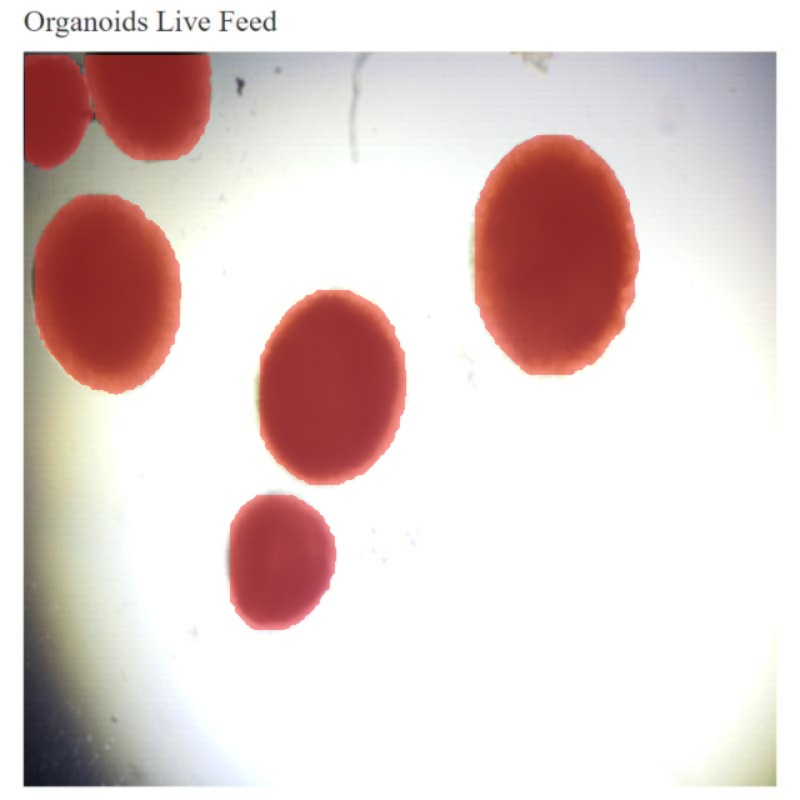

# Gautham Prabhakar
Hello my name is Gautham Prabhakar and I am a bioinformatics major at UCSD working on software that can help understand biological systems. I have significant software and programming experience through both research and industry geared towards biotech work and am proficient in:
- Java
- R
- Python
- C++
- C#
- Bash Scripting.

> What is bioinformatics?
> The application of tools of computation and analysis to the capture and interpretation of biological data in order to make judgements about diseases, biological systems and medicine. 

With my research and work experience I plan to pursue my PhD in mathematical and computational biology at UCI and work as a bioinformatics software engineer or project manager at biotech companies once I complete my degree. During this time I hope to learn more about the following:
1. Machine Learning
2. Genomics
3. Cardiovascular Diseases and how computational techniques can help understand them
4. Programming for academic journals
5. Writing Scientific Papers

## Research
I currently work in 2 labs: The Saier lab and Khoja lab. At the Saier lab, I am building an [automated system](https://github.com/gauthamp123/microbiome_project) that can take blast hits from a genome and make **accurate decisions** on which transport systems are present in the genome. Based on that, we can make comparisons between the functions of different bacteria which can be used to understand the transport systems roles when fighting off different diseases. At the Khoja Lab, I serve as both the **project leader and head of the AI team**. The project we are working on is finding a way to image and analyze mini-organs called organoids within a device and make accurate predictions about size and viability of organoids during a culturing time frame. I have been working to integrate both open-cv techniques as well as a segmentation YOLO model to make distinctions between cells and train data during the culturing process. 

## Internships
I worked a software internship at a laboratory automation company called [Biosero](https://biosero.com/). During my time there, I worked on various projects, starting off with creating a script editor that assemblies can be imported into and that incorporates IntelliSense to observe prefixes a user types in and dynamically provide suggestions for autocomplete. This way, a laboratory can use my software to create workflows without needing to know every robot's function, as it will just be listed out while they type. A version of this can be tried by cloning this repository: `git clone https://github.com/gauthamp123/Biosero_syntax_editor`. Soon after, I worked on driver development, writing drivers for robotic arms to move vials, plates, and racks across a lab from machine to machine for analysis. These drivers were successfully implemented and used throughout many labs within large companies like Roache and Invitae.  

This site was built using [GitHub Pages](https://pages.github.com/).